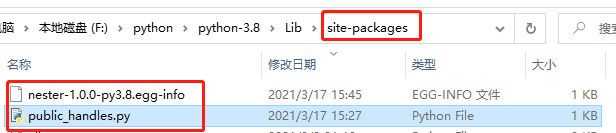

## 发布
#### 准备发布
- 创建发布目录， 例如nester发布目录
- 将业务代码赋值到发布目录下
- 新建一个setup.py文件，编写setup，将模块的元数据与setup关联
```
from distutils.core import setup

setup(
  name='nester',
  version='1.0.0',
  py_modules=['public_handles'],
  author='jumper0419',
  author_email='',
  url='',
  description='public_handles add handle_list_func'
)
```
#### 构建发布
- 构建一个发布文件：python setup.py sdist
  ```
  running sdist
  running check
  writing manifest file 'MANIFEST'
  creating nester-1.0.0
  making hard links in nester-1.0.0...
  hard linking public_handles.py -> nester-1.0.0
  hard linking setup.py -> nester-1.0.0
  creating dist
  Creating tar archive
  removing 'nester-1.0.0' (and everything under it)
  ```
  - 此时发布目录下多了一个dist目录，里面有一个发布包【压缩包】，包含这次要发布的内容
    - 压缩包包名为：setup.py中$name-$version.tar.gz
  - 发布目录还多了一个MAINFEST: 记录要发布的内容
    ```
    # file GENERATED by distutils, do NOT edit
    public_handles.py
    setup.py
    ```
- 将发布安装到你的python本地副本中：python setup.py install
  ```
  running install
  running build
  running build_py
  creating build
  creating build\lib
  copying public_handles.py -> build\lib
  running install_lib
  copying build\lib\public_handles.py -> F:\python\python-3.8\Lib\site-packages
  byte-compiling F:\python\python-3.8\Lib\site-packages\public_handles.py to public_handles.cpython-38.pyc
  running install_egg_info
  Removing F:\python\python-3.8\Lib\site-packages\nester-1.0.0-py3.8.egg-info
  Writing F:\python\python-3.8\Lib\site-packages\nester-1.0.0-py3.8.egg-info
  ```
  - 此时发布目录多了一个build目录
  - 在python的第三方安装包路劲下，多了业务模块
  